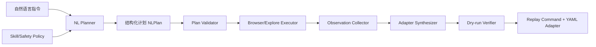

# AutoCLI 自然语言操作与参数生成能力评估

## 结论

评估时间：2026-04-25。

评估对象：

- 本机已安装命令：`autocli 0.3.8`
- 源码仓库：`https://github.com/nashsu/AutoCLI`
- 本地源码路径：`/Users/liushen/Documents/githubDevs/AutoCLI`
- 当前项目报告路径：`/Users/liushen/Documents/githubDevs/opencli/localdoc/autocli-natural-language-command-assessment.md`

结论先行：

- AutoCLI 比当前 OpenCLI 更接近“自动生成命令”的方向，因为它已经有 `explore`、`cascade`、`generate`、`generate --ai`。
- 但 AutoCLI 仍不支持“直接传入一段完整自然语言指令，然后按 Skill 安全策略完成操作”的通用 Agent 能力。
- AutoCLI 的 `generate` 支持“URL + 简短 goal -> 探索页面 API -> 生成 YAML adapter -> 保存为新命令”，这是参数/命令沉淀能力的雏形。
- AutoCLI 的 `generate --ai` 接入的是 AutoCLI.ai 云端生成接口，不是命令行参数指定任意 OpenAI-compatible / Anthropic-compatible 模型接口。
- AutoCLI 只能通过环境变量 `AUTOCLI_API_BASE` 改 AutoCLI 服务地址；这要求目标服务实现 AutoCLI.ai 的接口协议，不能直接填大模型 API base URL。
- 对“技术中台 CI 主机监控”场景，AutoCLI 能只读探索到页面和部分接口，但当前自动生成结果不够可靠：生成站点名异常、接口 URL 丢端口和路径前缀，不能直接视为可复跑命令。

一句话判断：AutoCLI 已经具备“网页 -> adapter -> 新命令”的产品化雏形，但还不是“自然语言巡检 Agent”；对内网业务系统可以作为探索和生成草稿的工具，不能直接承担稳定巡检闭环。

## 本机用法确认

`autocli -h` 显示它的定位是：

```text
AI-driven CLI tool — turns websites into command-line interfaces
```

关键内置命令包括：

- `explore`：探索网站 API surface 和 endpoint。
- `cascade`：探测 API endpoint 需要的认证策略。
- `generate`：一次性执行 explore + synthesize + 选择最佳 adapter。
- `search`：在 autocli.ai 搜索已有 adapter。
- `auth`：保存 AutoCLI token。

`autocli generate -h` 显示：

```text
Usage: autocli generate [OPTIONS] <url>

Options:
      --goal <goal>      What you want (e.g. hot, search, trending)
      --site <site>      Override site name
      --ai               Use AI (LLM) to analyze and generate adapter (requires ~/.autocli/config.json)
```

`autocli explore -h` 显示：

```text
Usage: autocli explore [OPTIONS] <url>

Options:
      --site <site>
      --goal <goal>
      --wait <wait>
      --auto
      --click <click>
```

`autocli doctor` 当前结果：

- Chrome/Chromium：通过。
- Daemon running：通过。
- Chrome extension connected：通过。
- External CLI 中 `gh`、`docker`、`kubectl` 未发现或未接入，这不影响本次网页探索能力判断。

本机没有 `~/.autocli/config.json`，因此没有 AutoCLI token；`generate --ai` 没有实测调用云端，只做源码评估。

## 源码架构

AutoCLI 是 Rust workspace，核心 crate：

- `crates/autocli-cli`：CLI 入口，使用 `clap` 动态注册 adapter 和内置命令。
- `crates/autocli-ai`：探索、认证策略探测、规则生成、AI 生成客户端。
- `crates/autocli-browser`：本地 daemon、Chrome extension bridge、AI extension proxy。
- `crates/autocli-discovery`：内置和用户 YAML adapter 发现。
- `crates/autocli-pipeline`：YAML pipeline 执行器。
- `crates/autocli-output`：table/json/yaml/csv/md 输出。

它的能力边界很清楚：核心资产仍是 YAML adapter 和确定性 pipeline；AI 主要用于生成 adapter，不是运行时持续规划每一步 UI 操作。

## 与原需求逐项对照

### 1. 能否传入一段自然语言指令进行操作

结论：不完整支持。

AutoCLI 没有类似下面这样的入口：

```bash
autocli run "根据 techmp-site-inspect 查看技术中台 CI 环境主机监控的各项信息"
autocli agent "..."
autocli nl run "..."
```

它接受的是 URL 和简短 `--goal`：

```bash
autocli explore <url> --goal <goal>
autocli generate <url> --goal <goal>
```

`--goal` 有简单的中英文归一化，源码在 `crates/autocli-ai/src/generate.rs:19-30`，支持 `search`、`hot`、`trending`、`feed`、`me`、`detail`、`comments`、`history`、`favorite` 等少数能力名。这不是完整自然语言任务解析，也不能理解 Skill 里的环境、安全、深度、输出策略。

对用户示例来说，`techmp-site-inspect` 的结构化参数应类似：

```text
target_env=ci
inspect_scope=single
target_identifier=主机监控
traversal_depth=deep
allow_write_confirm=false
```

AutoCLI 当前不会从完整自然语言中解析这些字段，也不会加载这个 Skill 的流程和风控策略。

### 2. 操作成功后能否生成新的命令行参数

结论：部分支持，但不是从“成功操作”反推出参数，而是从“页面探索结果”合成 adapter。

规则生成路径：

```text
autocli generate <url> --goal <goal>
  -> explore 页面和 API
  -> synthesize 候选 adapter
  -> 保存到 ~/.autocli/adapters/<site>/<name>.yaml
  -> 提示 autocli <site> <name>
```

源码证据：

- `crates/autocli-cli/src/main.rs:117-123` 注册了 `generate` 命令和 `--goal`、`--site`、`--ai`。
- `crates/autocli-cli/src/main.rs:1015-1022` 非 AI 路径调用 `autocli_ai::generate(...)`，成功后 `save_adapter(...)`。
- `crates/autocli-ai/src/generate.rs:135-159` 执行 `explore -> synthesize -> select`。
- `crates/autocli-ai/src/synthesize.rs:58-110` 根据探索结果生成候选 adapter。
- `crates/autocli-ai/src/synthesize.rs:331-430` 生成 YAML pipeline，包括 `navigate`、`evaluate/fetch`、`map`、`limit`。

这比 OpenCLI 当前“只有 browser init scaffold”更进一步：AutoCLI 会尝试生成完整 YAML，而不只是空骨架。

但风险也很明显：

- 它没有自动执行新 adapter 做端到端验证。
- 它不是从用户自然语言操作记录生成 replay command。
- 它不能保证生成的 endpoint、路径、字段选择正确。
- 对复杂内网站点，生成结果可能只是草稿。

### 3. AI 大模型接口地址能否通过命令行参数指定

结论：不支持以命令行参数指定任意大模型接口。

AutoCLI 的 `generate --ai` 没有 `--ai-base-url`、`--model`、`--api-key-env` 这类参数。它只要求 `~/.autocli/config.json` 里有 AutoCLI token。

源码证据：

- `crates/autocli-ai/src/config.rs:18-24` 通过 `AUTOCLI_API_BASE` 读取 AutoCLI 服务 base URL，默认 `https://www.autocli.ai`。
- `crates/autocli-ai/src/llm.rs:1-3` 写明 LLM 请求通过 AutoCLI server API，prompt 在服务端管理。
- `crates/autocli-ai/src/llm.rs:19` 固定调用 `{AUTOCLI_API_BASE}/api/ai/generate-adapter`。
- `crates/autocli-ai/src/llm.rs:40-48` 请求头使用 `Authorization: Bearer <token>`，不是读取 OpenAI/Anthropic API key。
- `crates/autocli-browser/src/daemon.rs:137-171` 和 `crates/autocli-browser/src/daemon.rs:590-596` 扩展侧 AI 生成也代理到 `{AUTOCLI_API_BASE}/api/ai/extension-generate`。

`crates/autocli-ai/src/config.rs:53-66` 定义了 `LlmConfig { endpoint, apikey, modelname }`，但搜索源码后没有发现它被 `generate --ai` 实际使用。这更像预留字段或历史遗留，并不能作为当前能力。

因此：

- 可以配置 `AUTOCLI_API_BASE=https://your-autocli-compatible-server`。
- 不能直接配置 `--ai-base-url https://api.openai.com/v1`。
- 若要私有化，需要实现 AutoCLI.ai 的服务端 API，而不是只提供一个 OpenAI-compatible endpoint。

## 技术中台 CI 主机监控实测

### explore 实测

执行受控只读探索：

```bash
autocli explore "$CI_ENV_TECHMP_URL#/devops/serverMonitor/chart" \
  --site techmp \
  --goal 主机监控 \
  --wait 3
```

为了避免把实时主机明细落盘，我只读取摘要，不保存完整 JSON。

实测摘要：

- URL：能进入 `#/devops/serverMonitor/chart?lang=zh-CN`
- title：`主机监控`
- framework：`Vue2`
- endpoint_count：`3`
- top endpoint 类型：cookie-auth JSON
- 识别到的接口类别包括主机/服务器列表、版本信息、主机指标 quota list。

这说明 AutoCLI 确实能复用浏览器登录态，访问内网技术中台页面，并发现部分后端接口。

但它没有完整覆盖页面所有信息：

- `serverMonitor.vue` 中大量趋势图依赖 `/devops/monitor/host/quota/trend`，本次普通 explore 摘要没有捕获到足够完整的趋势接口调用。
- `--auto` 和 `--click` 可能触发更多接口，但也可能误点 Tab、主机管理、进入 shell、删除/编辑等敏感入口。对技术中台这种运维系统，不应盲目启用。
- explore 输出的是 API manifest，不是巡检报告；它不会自动总结“各项信息”。

### generate 实测

为了避免污染用户真实 `~/.autocli`，我用临时 HOME 执行了非 AI 生成：

```bash
HOME=<tmp> autocli generate "$CI_ENV_TECHMP_URL#/devops/serverMonitor/chart" \
  --site techmp \
  --goal 主机监控
```

结果确实生成了 YAML adapter，并提示：

```text
autocli 211 主机监控
```

生成的 YAML 关键结构：

```yaml
site: 211
name: 主机监控
domain: 192.168.211.115
strategy: cookie
browser: true

pipeline:
  - navigate: "http://192.168.211.115:90/apollo-web/#/devops/serverMonitor/chart?lang=zh-CN"
  - evaluate: |
      (async () => {
        const res = await fetch("http://192.168.211.115/devops/monitor/config/server/list", {
          credentials: 'include'
        });
        const data = await res.json();
        return (data?.result?.data || []);
      })()
```

这次生成结果有几个关键问题：

1. `--site techmp` 没有生效，生成站点名是 `211`。源码里 `crates/autocli-cli/src/main.rs:885` 读取为 `_site`，但后续非 AI 路径 `crates/autocli-cli/src/main.rs:1017` 没有传入。
2. 生成的 fetch URL 丢了端口 `:90`，也丢了 `/apollo-web` 前缀。根因在 `crates/autocli-ai/src/synthesize.rs:264-269`，`build_templated_url()` 只拼了 `scheme + host + path`，没有包含 port；对有上下文路径或反向代理路径的内网站点容易出错。
3. 生成目标接口偏向 `/devops/monitor/config/server/list`，更像“服务器配置列表”，不是完整“主机监控各项信息”巡检。
4. 生成后没有自动验证新命令是否能运行、字段是否正确、是否覆盖趋势图。

因此，AutoCLI 在这个场景下可以生成 adapter 草稿，但不能直接说已经能完成“根据 Skill 查看 CI 主机监控各项信息，并生成可靠的新命令”。

## AI 生成路径的隐私与适配问题

`generate --ai` 的采集逻辑在 `crates/autocli-ai/src/ai_generate.rs:276-396`：

- 打开页面。
- 自动滚动。
- 从 Performance entries 中筛选 API URL。
- 最多重新 fetch 10 个 JSON API。
- 采集页面 meta、framework、globals。
- 截取主内容 HTML，最多 30000 字符。
- 把采集数据发到服务端。

这对公开站点生成 adapter 很有价值，但对技术中台这类内网运维系统有明显风险：

- 采集数据可能包含主机 IP、资源容量、系统版本、接口返回体、页面 DOM。
- 默认 AI 服务是 `https://www.autocli.ai`。
- 本地没有配置 AutoCLI token，所以本次没有实测上传。
- 即使设置 `AUTOCLI_API_BASE`，也必须确保它是可信的 AutoCLI-compatible 私有服务。

如果要用于技术中台，至少需要：

- 私有化 AutoCLI AI 服务。
- 确认采集数据脱敏。
- 限制 `capture_page_data` 不上传实时主机明细。
- 明确禁止对 stable/prdemo 这类环境执行 AI 上传。

## 与 OpenCLI 的关系

AutoCLI README 明确说它是基于 OpenCLI 的 Rust 重写，目标是单二进制、低内存、更快启动。两者理念相近，但当前能力有差异：

| 维度 | OpenCLI 当前 | AutoCLI 当前 |
| --- | --- | --- |
| 语言/分发 | TypeScript/Node | Rust 单 binary |
| 自然语言直接执行 | 不支持 | 不支持 |
| 浏览器原语 | `opencli browser` 明确暴露 | 没有等价低层 browser 子命令，更多用于 adapter/explore/generate |
| adapter 格式 | 当前主线偏 JS adapter，旧 YAML 用户 adapter 会警告 | YAML adapter 是核心格式 |
| 规则生成 adapter | `browser init` 生成骨架，`verify` 校验 | `generate` 可直接合成 YAML 草稿 |
| AI 生成 | OpenCLI 本体无通用 LLM planner | `generate --ai` 经 AutoCLI.ai 服务端生成 |
| 指定模型接口 | 不支持 | 不支持直接指定，只能 `AUTOCLI_API_BASE` 指向 AutoCLI 服务 |
| 技术中台场景 | 可用 browser 原语读取页面，但无业务 adapter | 可 explore，能生成草稿，但生成结果不可靠 |

判断上要避免一个误区：AutoCLI 的 “AI-driven” 更多指“AI 帮你生成 adapter”，不是“CLI 运行时像 Agent 一样理解并执行任意自然语言任务”。

## 是否能满足原始目标

原始目标可以拆成四项：

1. 输入自然语言指令。
2. 根据指令操作页面。
3. 成功后生成新的命令行参数或命令。
4. 大模型接口地址可通过命令行参数指定。

AutoCLI 当前满足情况：

- 第 1 项：不满足。只有 `--goal`，没有完整自然语言任务入口。
- 第 2 项：部分满足。`explore/generate` 能打开页面、滚动、捕获接口；不执行 Skill 级巡检策略。
- 第 3 项：部分满足。能生成 YAML adapter 和命令提示，但生成质量需要人工审查和修复。
- 第 4 项：不满足。没有命令行参数指定模型接口；`AUTOCLI_API_BASE` 是 AutoCLI 服务地址，不是模型地址。

对“查看技术中台 CI 主机监控各项信息”：

- 能探索页面并发现部分接口。
- 不能自动按 `techmp-site-inspect` 的流程完成深度巡检。
- 非 AI 生成的 adapter 草稿存在实际可用性问题。
- AI 生成可能更好，但默认要把页面/API 采集数据发到 AutoCLI.ai，不适合直接用于内网运维系统。

## 建议路线

### 如果想快速利用 AutoCLI

建议把 AutoCLI 当成“adapter 草稿生成器”，不是最终执行器：

1. 用 `autocli explore` 发现接口，输出只保留脱敏摘要。
2. 用 `autocli generate` 生成 YAML 草稿到临时 HOME。
3. 人工修正 `site`、endpoint port、上下文路径、字段、columns 和安全策略。
4. 手工执行新命令验证结果。
5. 验证通过后再把 adapter 放入受控目录。

对技术中台建议先做确定性命令：

```bash
autocli techmp server-monitor \
  --env ci \
  --target 主机监控 \
  --depth shallow \
  --format json
```

先不要上来做“自然语言万能巡检”。

### 如果想让 AutoCLI 真正满足原需求

需要补这些能力：

1. 新增 `autocli nl run "<instruction>"` 或 `autocli agent run "<instruction>"`。
2. 支持加载 Skill 或策略文件，把 `target_env/scope/target/depth/write-policy` 解析成结构化计划。
3. 新增本地 LLM provider 配置：
   - `--ai-provider`
   - `--ai-base-url`
   - `--ai-model`
   - `--ai-api-key-env`
   - `--dry-run`
   - `--execute`
4. 修复 `generate --site` 未传入非 AI synthesize 的问题。
5. 修复 `build_templated_url()` 丢 port 的问题，并处理内网站点上下文路径。
6. 生成 adapter 后自动 dry-run 验证。
7. 增加敏感数据脱敏与上传开关。
8. 将 `techmp-site-inspect` 这类运维 Skill 的只读/写操作策略内置到执行层，而不是只靠 prompt。

### 对当前项目的借鉴

AutoCLI 的 `explore -> synthesize -> save adapter` 这条链路值得 OpenCLI 借鉴，但不建议照搬云端 AI 路线到内网场景。

更稳妥的设计是：

```text
自然语言
  -> 本地/私有 LLM 生成可审计计划
  -> 确定性 browser/explore 操作
  -> 规则合成 adapter 草稿
  -> 自动 dry-run 验证
  -> 输出 replay command
  -> 人工确认后保存 adapter
```

其中 LLM 只做规划和草稿生成，不能绕过执行层安全策略。

## 验证边界

已执行：

- `autocli -h`
- `autocli --version`
- `autocli generate -h`
- `autocli explore -h`
- `autocli cascade -h`
- `autocli doctor`
- 克隆源码到 `/Users/liushen/Documents/githubDevs/AutoCLI`
- 源码阅读 `crates/autocli-cli`、`crates/autocli-ai`、`crates/autocli-browser`
- 对技术中台 CI 主机监控执行只读 `autocli explore` 摘要验证
- 用临时 HOME 执行非 AI `autocli generate`，未污染真实 `~/.autocli`

未执行：

- `generate --ai`：未直接执行；该路径默认会向 AutoCLI.ai 上传页面采集数据，不适合直接用于技术中台内网数据。

## 最终判断

AutoCLI 可以作为“自动探索网页并生成 CLI adapter 草稿”的工具，能力明显覆盖了 OpenCLI 当前缺失的一部分参数/命令生成链路。

但对于用户提出的完整目标，它还差三层：

- 自然语言任务解析层。
- Skill 级安全策略执行层。
- 可配置大模型接口和私有化数据治理层。

因此，AutoCLI 当前不能直接完成“传入自然语言 -> 按 `techmp-site-inspect` 深度巡检技术中台 CI 主机监控 -> 成功后生成可靠命令参数 -> 通过命令行指定任意 AI 大模型接口”这一完整闭环。它最多能帮助生成初版 adapter，且在技术中台实测中生成结果还需要人工修正。

## 2026-04-25 补充：Rust 环境恢复后的源码级评估

用户已补充安装 Rust/Cargo 后，继续在 AutoCLI 源码仓库 `/Users/liushen/Documents/githubDevs/AutoCLI` 验证，当前源码提交短 SHA 为 `c0969e2`。

### 新增验证结论

本次执行了 Rust 测试基线：

```bash
cargo test -p autocli-ai
cargo test --workspace
```

结果：

- `cargo test -p autocli-ai` 通过：`61 passed`。
- `cargo test --workspace` 未全绿：`autocli-pipeline` 的 `steps::download::tests::test_download_with_url_in_data` 失败，断言中 `download_url` 实际为 `Null`，期望为 `https://example.com/article.pdf`。
- workspace 失败点不在自然语言/AI 生成链路，但说明当前仓库存在既有回归风险；增强前应先把目标改动路径补上单测，避免把已有失败误判为新增问题。

### 源码级缺口重新确认

#### 1. `--site` 参数在 `generate` 主链路中没有生效

CLI 注册了参数：

```rust
Command::new("generate")
    .arg(Arg::new("site").long("site").help("Override site name"))
```

但路由时只读取成 `_site`，没有传给规则生成或 AI 生成：

```rust
let _site = site_matches.get_one::<String>("site").cloned();
...
autocli_ai::generate(page.as_ref(), url, goal.as_deref().unwrap_or("")).await;
```

影响：

- 内网 IP 场景会落回 `detect_site_name(url)`。
- 技术中台 `--site techmp` 实测仍生成 `site: 211`。
- `generate_full()` 虽然有 `GenerateOptions.site`，但当前 CLI 没有走这个函数。

修复方向：

- 规则生成路径改为调用 `generate_full(page, GenerateOptions { site, goal, url, top })`，或给现有 `generate()` 增加 options。
- AI 生成路径给 `generate_with_ai()` 增加 `site_override: Option<String>`，并在强制替换 YAML `site:` 时优先使用 override。
- `GenerateResult.selected_command` 也不能再用 `detect_site_name(&opts.url)`，应优先使用 `opts.site` 或 selected candidate 的 `site`。

#### 2. AI 接口地址当前不能通过 CLI 指向任意大模型

源码里已有 `LlmConfig`：

```rust
pub struct LlmConfig {
    pub endpoint: Option<String>,
    pub apikey: Option<String>,
    pub modelname: Option<String>,
}
```

但当前 AI 生成主链路没有使用这组配置。`crates/autocli-ai/src/llm.rs` 明确写的是：

```rust
//! Routes all requests through the AutoCLI server API.
let endpoint = format!("{}/api/ai/generate-adapter", api_base());
```

`AUTOCLI_API_BASE` 的真实含义是 AutoCLI 服务端基址，例如：

- `https://www.autocli.ai/api/ai/generate-adapter`
- `https://www.autocli.ai/api/ai/extension-generate`

它不是 OpenAI-compatible 的 `chat/completions` 地址。因此，原需求中的“用哪个 AI 大模型接口地址，可通过命令行参数传入指定”目前不成立。

修复方向：

- 新增直接 LLM provider 层，不复用 `AUTOCLI_API_BASE` 语义。
- 首期支持 OpenAI-compatible Chat Completions：

```bash
autocli generate <url> \
  --ai \
  --ai-provider openai-compatible \
  --ai-base-url https://api.example.com/v1 \
  --ai-model <model> \
  --ai-api-key-env OPENAI_API_KEY
```

- CLI 参数中只传 key 的环境变量名，不直接传明文 key。
- 保留 AutoCLI.ai 作为 `--ai-provider autocli-cloud`，避免破坏现有用户。

#### 3. URL 模板生成会丢端口

`build_templated_url()` 当前拼接方式为：

```rust
let base = format!(
    "{}://{}{}",
    parsed.scheme(),
    parsed.host_str().unwrap_or(""),
    parsed.path()
);
```

`host_str()` 不包含端口，因此 `http://192.168.211.115:90/...` 会被生成成 `http://192.168.211.115/...`。

影响：

- 技术中台 CI 的 `:90` 被丢掉，生成 adapter 不能稳定重放。
- 这类 bug 对公网常规 `80/443` 不明显，对内网系统是硬伤。

修复方向：

- 使用 `parsed.origin().ascii_serialization()` 或手动保留 `port_or_known_default()`。
- 增加单测覆盖：

```text
http://192.168.211.115:90/apollo-web/devops/monitor/config/server/list
```

期望生成后仍保留 `:90`。

#### 4. 网络捕获仍偏“Performance API + 二次 fetch”，不是完整 CDP 请求录制

浏览器层 `get_network_requests()` 的实现本质是执行：

```javascript
performance.getEntriesByType('resource')
```

再在 `smart_api_discovery()` 和 `capture_page_data()` 中对候选 URL 做 `fetch(url, { credentials: 'include' })` 以补响应体。

优点：

- 实现简单。
- 对 GET JSON 列表类接口有效。

限制：

- Performance API 默认拿不到请求体、完整响应头、POST body、XHR/fetch 的业务语义。
- 二次 fetch 可能改变服务端状态，或因接口一次性 token、时间戳、签名参数导致失败。
- 对需要先点击 Tab、切换筛选条件后才出现的接口，必须先有更强的操作计划。

这解释了为什么 AutoCLI 能发现技术中台主机监控的部分接口，但还不能等价执行 `techmp-site-inspect` 的深度巡检流程。

增强方向：

- 短期保留 Performance API 方案，用于低风险探索。
- 中期在 `autocli-browser` 增加 CDP `Network.requestWillBeSent`、`Network.responseReceived`、`Network.getResponseBody` 的会话级录制能力。
- 对写接口和非 GET 接口默认只记录，不自动重放。

#### 5. AutoCLI 已具备“生成命令”的底座，但缺少“自然语言计划层”

已有底座：

- YAML adapter 解析：`autocli-discovery/src/yaml_parser.rs`
- 用户 adapter 目录：`~/.autocli/adapters`
- 动态注册命令：`Registry`
- 动态 Clap 子命令生成：根据 adapter 的 `site/name/args` 生成 `autocli <site> <command> --arg value`
- Pipeline 执行：`navigate/evaluate/fetch/map/filter/sort/limit/download` 等步骤

缺口：

- 没有 `autocli nl plan/run "<自然语言>"` 入口。
- 没有 Skill 文件解析与策略落地。
- 没有把“执行成功后的 replay command / adapter 参数”作为稳定产物输出。
- 现有 `generate` 是从 URL+goal 推 adapter，不是从自然语言推任务计划。

## 是否适合开发增强

结论：可以增强，但不建议把“自然语言万能 Agent”直接塞进现有 `generate`。更稳的做法是分层：先修现有生成链路，再加计划层，最后针对技术中台这类高风险内网系统做确定性执行器。

### 推荐总体架构



核心原则：

- LLM 只负责“理解、规划、生成草稿”，不能直接绕过执行层点击页面。
- 执行层必须有确定性安全策略，尤其是 Stable/PRDemo 只读、CI/Local 写操作二次确认。
- 默认 `dry-run`，只有用户显式传 `--execute` 才真正执行浏览器动作。
- 内网数据默认不出网，只有显式 `--allow-upload` 或选择 cloud provider 才允许发送页面采集数据。

## 建议实现方案

### 阶段 1：先修现有 `generate` 的确定性问题

目标：让 AutoCLI 作为 adapter 草稿生成器时至少可控。

建议改动：

1. `generate --site` 真正生效。
2. `build_templated_url()` 保留端口。
3. `generate --output <path>` 支持把 adapter 写到指定位置，而不是只能写入 `~/.autocli/adapters`。
4. `generate --print` 只输出 YAML，不落盘。
5. `generate --no-upload` 或默认不上传，AI/cloud 上传必须显式确认。
6. 给内网 URL、端口、hash route、site override 增加单测。

这一阶段不需要自然语言 Agent，但能立刻解决技术中台实测中最明显的错误。

### 阶段 2：实现可指定大模型接口的 provider 层

新增模块建议：

```text
crates/autocli-ai/src/provider.rs
crates/autocli-ai/src/prompt.rs
crates/autocli-ai/src/redact.rs
```

CLI 参数建议：

```bash
--ai-provider openai-compatible|autocli-cloud
--ai-base-url <url>
--ai-model <model>
--ai-api-key-env <ENV_NAME>
--ai-timeout <seconds>
--ai-max-tokens <n>
--privacy local-only|redacted|allow-sensitive
```

OpenAI-compatible 请求建议固定为：

```text
POST {base_url}/chat/completions
Authorization: Bearer ${ENV_NAME}
model: <model>
messages: [...]
response_format: json_object
```

这里要避免一个设计坑：不要把 `AUTOCLI_API_BASE` 改造成模型地址，否则会破坏现有 AutoCLI.ai、搜索、上传、扩展代理等 API 语义。应使用新的 `--ai-base-url` 或 `AUTOCLI_LLM_BASE_URL`。

### 阶段 3：新增自然语言计划命令

建议新增两个命令，而不是只加一个 `run`：

```bash
autocli nl plan "<instruction>" \
  --skill /path/to/SKILL.md \
  --ai-provider openai-compatible \
  --ai-base-url https://api.example.com/v1 \
  --ai-model <model> \
  --ai-api-key-env OPENAI_API_KEY

autocli nl run "<instruction>" \
  --skill /path/to/SKILL.md \
  --execute \
  --save-adapter \
  --format json
```

`plan` 只输出结构化计划，便于审计；`run` 执行计划。

计划结构建议：

```json
{
  "intent": "inspect_site",
  "target_env": "ci",
  "inspect_scope": "single",
  "target_identifier": "主机监控",
  "target_route": "#/devops/serverMonitor/chart",
  "traversal_depth": "deep",
  "allow_write_confirm": false,
  "safety_level": "read_only",
  "expected_outputs": ["summary", "screenshot", "replay_command", "adapter_yaml"],
  "actions": [
    {"type": "resolve_env"},
    {"type": "open_url"},
    {"type": "reuse_or_login"},
    {"type": "navigate", "target": "主机监控"},
    {"type": "collect_dom"},
    {"type": "collect_network"},
    {"type": "summarize"}
  ]
}
```

计划校验规则：

- `stable/prdemo` 强制 `read_only`。
- `allow_write_confirm` 默认 false。
- 任何写操作动作必须带风险标签，并在 `run` 前要求显式 `--execute-write` 或交互确认。
- URL、环境变量、凭据只由执行器解析，LLM 不直接接触明文密码。

### 阶段 4：针对 `techmp-site-inspect` 做确定性执行器

技术中台不适合只靠通用 NL+LLM。更合适的是把 Skill 中的稳定知识落成一个通用但可配置的 inspect 执行器。

建议命令：

```bash
autocli techmp inspect \
  --env ci \
  --scope single \
  --target "主机监控" \
  --depth deep \
  --allow-write-confirm false \
  --format json
```

自然语言入口生成的 replay command 可以是：

```bash
autocli techmp inspect --env ci --scope single --target "主机监控" --depth deep --format json
```

也可以进一步生成页面专用 adapter：

```bash
autocli techmp server-monitor --env ci --format table
```

实现要点：

- 从 Skill 中抽取环境变量映射：
  - `ci -> CI_ENV_TECHMP_URL / CI_ENV_TECHMP_USERNAME / CI_ENV_TECHMP_PASSWORD`
  - `stable -> STABLE_ENV_TECHMP_URL / ...`
  - `prdemo -> PRDEMO_ENV_TECHMP_URL / ...`
  - `local -> localhost 或 LOCAL_DEV_*`
- 内置高频页面路由映射：
  - `主机监控 -> #/devops/serverMonitor/chart`
  - `容器状态监控 -> #/devops/instanceMonitor/chart`
  - `容器性能监控 -> #/devops/containerPerfMonitor/char`
  - `告警统计 -> #/devops/alarmStatistics`
- 登录状态复用优先；只有识别到登录页才使用凭据。
- 单页巡检至少返回：
  - 当前 URL、标题、核心 DOM 文本摘要
  - 主表格字段与行数
  - 关键接口 URL 与响应摘要
  - 可见错误 Toast/Alert
  - 截图路径
  - replay command

对“技术中台 CI 主机监控各项信息”的最小可用结果，应该包含：

- 页面是否成功打开，标题是否为 `主机监控`。
- 主机列表字段：IP、主机名、运行时间、内存、CPU 核、磁盘、系统负载、CPU/内存使用率等。
- Top N 面板是否存在：CPU、内存、系统负载、上下文切换、GPU、TCP 连接数、打开文件数、I/O、磁盘、网络。
- 接口层至少捕获并解释：
  - `/devops/monitor/config/server/list`
  - `/devops/monitor/host/quota/list`
- 写操作探测默认跳过或只记录，不点击确认。

### 阶段 5：生成后自动验证

原需求里“操作成功完成后，还能将其生成新的命令行参数”有一个隐含要求：生成的命令必须能重放。

建议新增：

```bash
--verify
--verify-timeout 60
--save-adapter verified-only
```

验证流程：

1. 先执行计划。
2. 生成 replay command 或 YAML adapter。
3. 用隔离 HOME 或临时 adapter registry 执行一遍。
4. 验证返回结构非空、关键字段存在、没有明显错误页/登录页。
5. 只有验证通过才保存到用户 adapter 目录。

## 具体开发任务拆分

### P0：回归基线与小修

- 修复或隔离当前 workspace 失败的 download 单测。
- 补 `generate --site` 透传单测。
- 补内网端口 URL 单测。
- 补 `generate_full.selected_command` 使用 site override 的单测。

### P1：规则生成链路增强

- CLI `generate` 改用 `GenerateOptions`。
- 修复 `build_templated_url()`。
- 增加 `--output`、`--print`、`--no-upload`。
- AI 生成路径支持 site override。

### P2：LLM provider

- 新增 OpenAI-compatible client。
- 新增 JSON response parser 与错误处理。
- 新增 prompt 模板，要求模型输出严格 JSON 或 YAML。
- 新增数据脱敏：cookie、token、authorization、password、session、内网 IP 可配置脱敏。

### P3：自然语言计划层

- 新增 `nl plan`。
- 新增 `nl run`。
- 新增 Skill Markdown 轻量解析器，先只提取：
  - 输入参数
  - 环境变量映射
  - 安全策略
  - 高频页面路由
- 新增计划 schema 与 validator。

### P4：TechMP inspect MVP

- 新增通用 `inspect` 执行器或 `techmp inspect` 命令。
- 支持 `ci/local/stable/prdemo/custom`。
- 支持 `single` scope。
- 支持主机监控页面。
- 输出 JSON/Markdown 两种格式。
- 成功后输出 replay command。

### P5：深度巡检与生成 adapter 闭环

- 支持 Tab/Sub-nav 串行遍历。
- 支持模块/全站 scope。
- 支持截图命名与产物目录。
- 支持验证通过后保存 adapter。

## 推荐最小 MVP

不要第一步就做“任意自然语言操作网页”。最小 MVP 应该是：

```bash
autocli nl plan "查看技术中台CI环境主机监控的各项信息" \
  --skill /Users/liushen/Documents/cursorDevs/trsdevops/apollo-web/.agents/skills/techmp-site-inspect/SKILL.md \
  --ai-provider openai-compatible \
  --ai-base-url <model-base-url> \
  --ai-model <model> \
  --ai-api-key-env <key-env>
```

输出计划后，再执行：

```bash
autocli techmp inspect --env ci --scope single --target "主机监控" --depth deep --format json
```

执行成功后输出：

```text
replay_command: autocli techmp inspect --env ci --scope single --target "主机监控" --depth deep --format json
generated_adapter: ~/.autocli/adapters/techmp/server-monitor.yaml
```

这样既满足原需求的核心闭环，又把高风险动作放在确定性执行器里。

## 风险与反建议

1. 不建议把技术中台专有逻辑硬编码进 AutoCLI 上游公共项目。更合理的是 AutoCLI 提供通用 plugin/adapter/skill 执行能力，TechMP 规则放本项目或本地私有 adapter。
2. 不建议默认把页面 DOM、接口响应、内网 URL 发给云端 AI。内网运维系统要默认 local-only。
3. 不建议让 LLM 直接生成可执行 JS 并立即执行。应先生成 plan，再由白名单 action 执行。
4. 不建议只输出 YAML adapter 就算成功。必须 dry-run 验证，否则“生成命令参数”只是文本生成，不是可用能力。
5. 不建议一开始覆盖写操作自动化。只读巡检稳定后，再单独设计写操作确认和审计。

## 最终增强判断

AutoCLI 现有架构有 adapter、动态 CLI、browser pipeline、explore/synthesize，适合作为增强基础；但它现在缺的是“计划层、安全层、私有 LLM provider 层、生成后验证层”。

如果按上述阶段开发，AutoCLI 可以增强到满足原需求：

- 输入自然语言。
- 解析 `techmp-site-inspect` 这类 Skill。
- 用命令行指定 OpenAI-compatible 大模型接口。
- 执行技术中台 CI 主机监控只读巡检。
- 成功后输出可重放命令与可验证 adapter。

但在当前未增强版本中，仍不能直接满足该完整目标。

## 2026-04-25 补充：加强版实现形态、慢页面策略与 Fork 建议

### 1. 是否可以自研 AutoCLI 加强版

可以。从源码摸底看，AutoCLI 的动态 adapter、browser pipeline、YAML 命令注册、explore/synthesize 机制已经提供了一个不错的底座。加强版不是从零造 CLI，而是在现有能力上补齐四层：

- 自然语言计划层：把用户含混指令解析成结构化 `NLPlan`。
- 执行安全层：环境隔离、只读/写操作策略、数据脱敏、低置信度确认。
- 浏览器可靠性层：等待策略、加载态识别、网络安静、DOM 稳定、重试与证据收集。
- 生成验证层：成功执行后输出 replay command / adapter，并自动 dry-run 验证。

但需要明确：这已经不是“AutoCLI 多加一个 AI 参数”级别的改造，而是一个面向内部系统巡检/操作的 agentic CLI。它可以复用 AutoCLI，但产品边界应定义为“可审计的网页操作与命令生成平台”，而不是“自然语言万能浏览器”。

### 2. 含混自然语言不能原样转给大模型

加强版不应该把用户原始话术直接转给 AI。更稳的链路应是：

```text
用户自然语言
  -> 意图归一化与缺失项检测
  -> Skill/站点知识注入
  -> 最佳实践与安全策略注入
  -> LLM 生成结构化计划
  -> 本地 validator 修正/拒绝/追问
  -> 浏览器执行器按确定性策略执行
  -> 证据门禁后输出结论和 replay command
```

这里有一个关键原则：提示词可以告诉模型“要等页面加载完成”，但是否真的等够、是否还在转圈、是否可以判定没数据，必须由本地执行器验证，不能只靠模型自觉。

### 3. 慢页面、加载态、误判空数据的组合方案

这些方案不是互斥的，应按风险和场景组合使用。

#### 方案 A：Prompt 注入最佳实践

在发给 LLM 的 system/developer prompt 中内置通用网页操作规则：

- 不要在页面主区域仍显示 loading/spinner/skeleton 时下结论。
- 看到“暂无数据/没数据”时，先确认页面不再加载、接口已返回、表格区域稳定。
- 慢页面要使用等待-复查循环，而不是一次 DOM 快照就判断。
- 对空结果要区分“真实空数据”“仍在加载”“接口失败”“未登录/无权限”“筛选条件导致为空”。
- 对含混指令要先补全或提问，不要猜测高风险动作。

优点：成本低，能改善模型行为。

缺点：不可靠。模型仍可能过早下结论，尤其是小模型、长上下文或页面状态复杂时。

适用：低风险页面、只读摘要、生成初步计划。

#### 方案 B：结构化计划与本地校验

要求 LLM 只输出结构化计划，不直接执行判断：

```json
{
  "target_env": "ci",
  "target": "主机监控",
  "readiness_policy": {
    "max_wait_ms": 30000,
    "network_quiet_ms": 1000,
    "spinner_absent": true,
    "dom_stable_samples": 2,
    "empty_state_requires_ready": true
  },
  "ambiguities": [],
  "actions": [
    {"type": "navigate", "target": "#/devops/serverMonitor/chart"},
    {"type": "wait_until_ready"},
    {"type": "collect_table"},
    {"type": "collect_network"},
    {"type": "summarize"}
  ]
}
```

本地 validator 负责：

- 缺少环境、目标、scope、depth 时补安全默认值或追问。
- Stable/PRDemo 强制只读。
- `empty_state_requires_ready=true` 作为硬规则。
- 对写操作、删除、提交、确认类动作拒绝或要求显式确认。
- 给每个页面动作补默认 wait/readiness 策略。

优点：可审计、可测试、不会让模型绕过安全层。

缺点：需要定义计划 schema、validator 和错误恢复逻辑。

适用：加强版的默认核心方案。

#### 方案 C：执行器内置页面就绪判断

这是解决“页面还在转圈却返回没数据”的关键。浏览器执行器应提供统一的 `wait_until_ready`，而不是让模型自己 sleep。

建议实现 `ReadinessPolicy`：

```text
initial_delay_ms
max_wait_ms
soft_timeout_ms
poll_interval_ms
network_quiet_ms
dom_stable_samples
spinner_selectors
skeleton_selectors
main_region_selectors
table_selectors
empty_state_selectors
required_text_or_selector
min_rows
```

判定流程：

1. 等待路由稳定：URL/hash 不再变化。
2. 等待网络安静：CDP 记录的 XHR/fetch 在 `network_quiet_ms` 内没有新增或 pending。
3. 等待加载态消失：spinner、loading 文案、skeleton、进度条不可见。
4. 等待主区域稳定：主区域文本长度、表格行数、关键 DOM hash 连续 N 次采样不变。
5. 若看到空状态，只能在 1-4 都满足后才允许输出“暂无数据”。
6. 若超过超时仍未稳定，输出“页面加载未完成/疑似卡住”，而不是输出“没数据”。

慢页面也不能无限等待。建议把等待拆成两层：

- `soft_timeout_ms`：超过正常合理范围后暂停并返回“目标系统响应较慢，当前仍未满足页面就绪条件”，在交互模式下询问用户是否继续等待。
- `max_wait_ms`：绝对上限，超过后强制停止本轮动作，输出超时证据和建议，不继续自动等待。

示例策略：

```text
shallow inspect:
  soft_timeout_ms = 15000
  max_wait_ms = 30000

deep inspect:
  soft_timeout_ms = 30000
  max_wait_ms = 90000

known slow internal system:
  soft_timeout_ms = 45000
  max_wait_ms = 180000
```

交互模式下，超过 `soft_timeout_ms` 时可以提示：

```text
目标系统响应较慢，已等待 30 秒，但页面仍在加载或接口仍未稳定。是否继续等待 60 秒？
```

非交互模式下不能询问用户，应按策略退出并返回机器可读状态：

```json
{
  "status": "timeout_soft_or_hard",
  "ready": false,
  "reason": "spinner_visible_or_network_pending",
  "waited_ms": 30000,
  "suggestion": "rerun with --wait-extra 60 or check target system latency"
}
```

这样可以同时避免两种错误：过早把 loading 判成“没数据”，以及在目标系统异常时无限挂起 CLI。

优点：最可靠，能系统性解决慢页面误判。

缺点：需要 CDP 网络监控和一组通用/站点专用 selector；不同系统 loading 组件差异较大。

适用：所有网页执行默认启用，内网管理系统必须启用。

#### 方案 D：证据门禁与结论分级

执行器输出结论前必须带证据：

```json
{
  "claim": "主机列表暂无数据",
  "confidence": 0.82,
  "evidence": {
    "ready": true,
    "network_quiet": true,
    "spinner_visible": false,
    "empty_state_visible": true,
    "table_rows": 0,
    "api_status": 200,
    "api_items_count": 0,
    "screenshot": "..."
  }
}
```

如果证据不够，输出应降级：

- `ready=false`：页面仍在加载，不能判定数据为空。
- `network_error=true`：接口异常，不能判定业务无数据。
- `login_detected=true`：未登录或登录态失效。
- `permission_denied=true`：无权限，不等于无数据。
- `filter_maybe_active=true`：筛选条件可能导致为空。

优点：可解释，能防止模型把观察误当事实。

缺点：输出结构更复杂，需要 UI/CLI 渲染上区分“事实、推断、风险”。

适用：巡检报告、运维排障、自动生成命令前的验证。

#### 方案 E：站点/Skill 专用 Recipe

通用规则不够时，需要 Skill 或本地 recipe 提供站点特化知识。例如技术中台：

```yaml
site: techmp
routes:
  主机监控: "#/devops/serverMonitor/chart"
readiness:
  main_region: "#app"
  spinner_text: ["加载中", "Loading"]
  table_keywords: ["IP", "主机名", "CPU", "内存"]
  expected_apis:
    - "/devops/monitor/config/server/list"
    - "/devops/monitor/host/quota/list"
empty_state:
  allowed_only_after:
    - spinner_absent
    - network_quiet
    - expected_apis_resolved
```

优点：对内部系统最稳，能沉淀组织经验。

缺点：需要维护 recipe，页面改版后要更新。

适用：技术中台、CI/CD、监控系统、权限复杂的后台系统。

#### 方案 F：低置信度追问与非交互默认策略

用户自然语言含混时，不能一律猜。建议分两种运行模式：

交互模式：

- 缺少环境：问用户，或提示默认用 CI。
- 缺少 scope：问是单页、模块还是全站。
- 指令包含可能写操作：要求确认。
- 目标匹配多个菜单：列出候选让用户选。

非交互模式：

- 默认 `target_env=ci`。
- 默认 `inspect_scope=single`，如果能明确页面；否则只生成 plan 不执行。
- 默认 `depth=shallow`，除非用户明确“深入/各项信息/排障”。
- 默认 `allow_write_confirm=false`。
- 低置信度时退出并返回需要补充的字段，而不是强行执行。

优点：兼顾自动化和安全。

缺点：会牺牲部分“一句话全自动”的体验。

适用：CLI 产品必须支持，尤其适合 CI/CD 脚本场景。

### 4. 推荐组合

建议加强版采用以下默认组合：

```text
Prompt 最佳实践
  + 结构化 NLPlan
  + 本地 validator
  + ReadinessPolicy 执行器
  + 证据门禁
  + Skill/Recipe 专用规则
  + 低置信度追问
```

也就是说，prompt 是必要但不充分的；真正可靠性来自执行器和 validator。

对“页面主区域还在转圈，但模型返回没数据”的具体处理应设为硬规则：

```text
只要 spinner/skeleton/loading 仍可见，或网络请求仍 pending，或主区域 DOM 未稳定：
  禁止输出“没数据”
  禁止生成已验证成功的 replay command
  只能输出“仍在加载/超时未完成/是否继续等待/需要重试”的状态
```

### 5. 是否 Fork 原工程

建议 Fork，而且采用“混合策略”最合适。

原因：

- 原需求已经超出 AutoCLI 原作者当前产品边界：自然语言计划、私有模型接口、Skill 执行、安全策略、内网站点 recipe、生成后验证，都不一定符合上游项目方向。
- 如果直接在原工程做大改，PR 很可能因为范围过大、产品理念不同、维护成本高而难以合并。
- 内网运维系统的安全策略和 TechMP recipe 不适合进入公共上游。

推荐策略：

1. Fork AutoCLI 作为加强版研发主线，保证可以快速演进。
2. 将通用且低争议的小修拆成上游 PR：
   - `generate --site` 生效。
   - URL 模板保留端口。
   - 补充单元测试。
   - `generate --print/--output` 这类通用能力。
3. 将高争议或内部相关能力留在 fork：
   - OpenAI-compatible 私有 LLM provider。
   - `nl plan/run`。
   - Skill parser。
   - TechMP recipe。
   - 内网数据脱敏策略。
4. 尽量把增强能力做成新 crate 或 plugin 层，减少对原核心的侵入，降低后续 rebase 成本。
5. 定期从 upstream 合并 bugfix，而不是长期完全脱钩。

可选形态对比：

| 形态 | 优点 | 缺点 | 建议 |
| :--- | :--- | :--- | :--- |
| 只做 wrapper CLI | 不改上游，启动快 | 很难修复 `generate --site`、CDP 捕获、pipeline 内部问题 | 适合 PoC，不适合长期 |
| 直接 Fork 深改 | 控制力强，最快满足内部需求 | 与上游分叉风险高 | 适合 MVP 和内部落地 |
| Fork + 上游小 PR + 新 crate/plugin | 兼顾控制力和可维护性 | 工程组织更复杂 | 推荐 |
| 从零重写 | 架构最自由 | 成本高，浪费 AutoCLI 现有底座 | 暂不建议 |

最终建议：先 Fork，并命名为内部加强版；第一阶段保留上游 remote，完成 P0/P1 通用修复和 P2/P3 架构雏形；能上游的修复单独 PR，不能上游的能力留在 fork 或本项目私有 plugin。

### 6. 适合作为上游通用修复 PR 的内容

本节只列适合提交给 AutoCLI 上游的通用修复，不包含 TechMP 私有能力、内网 recipe、私有化安全策略和完整自然语言 Agent。

#### 最新代码复核

已执行：

```bash
git fetch origin --prune
git rev-parse HEAD origin/main origin/HEAD
git diff --stat HEAD..origin/main
cargo test -p autocli-pipeline steps::download::tests::test_download_with_url_in_data
```

复核结果：

- `HEAD`、`origin/main`、`origin/HEAD` 均为 `c0969e2c83b29a7528452b1ba555085deca8e00d`，即 `v0.3.8`，远端主线当前没有新提交。
- `git diff --stat HEAD..origin/main` 为空，本地与最新远端主线一致。
- `generate --site` 未修复：`crates/autocli-cli/src/main.rs:885` 仍读取为 `_site`，后续规则生成与 AI 生成都未传入。
- AI 生成仍固定走 AutoCLI 服务端：`crates/autocli-ai/src/llm.rs:1-3` 注释仍说明请求通过 AutoCLI server API，`crates/autocli-ai/src/llm.rs:19` 仍拼接 `{api_base}/api/ai/generate-adapter`。
- URL 模板丢端口未修复：`crates/autocli-ai/src/synthesize.rs:264-269` 仍用 `parsed.host_str()` 拼接 base URL。
- download 单测失败仍可复现：`steps::download::tests::test_download_with_url_in_data` 仍失败，`download_url` 实际为 `Null`。

因此，下面这些 PR 不是重复劳动，仍有提交价值。

#### PR 1：让 `generate --site` 真正生效

问题：

- CLI 有 `--site` 参数，但只读成 `_site`。
- 规则生成路径调用 `autocli_ai::generate(page, url, goal)`，没有携带 site override。
- AI 生成路径调用 `generate_with_ai(page, url, goal, token)`，也没有携带 site override。

建议范围：

- CLI `generate` 改用 `GenerateOptions` 或新增带 options 的生成函数。
- `generate_with_ai()` 增加 `site_override`。
- `GenerateResult.selected_command` 优先使用 override site。
- 增加单测覆盖 IP host、`--site techmp`、AI/non-AI 两条路径。

上游可接受度：高。它是已有 CLI 参数未生效的 bugfix。

#### PR 2：修复 URL 模板生成丢端口

问题：

- `build_templated_url()` 用 `host_str()` 拼 base，导致非默认端口丢失。
- 内网、测试环境、自托管服务常用非默认端口，生成 adapter 后无法重放。

建议范围：

- 使用 `parsed.origin().ascii_serialization()` 或等价方法保留 scheme、host、port。
- 保留现有 query 参数模板化逻辑。
- 增加单测：
  - `http://192.168.211.115:90/path/list`
  - `http://localhost:5173/api/list`
  - `https://example.com:8443/api/list`
  - 默认 `80/443` 不产生异常变化。

上游可接受度：高。它是通用 URL correctness bugfix。

#### PR 3：修复 `generate_full()` 的 selected command 站点名

问题：

- `generate_full()` 接收 `GenerateOptions.site`，但 selected command 仍通过 `detect_site_name(&opts.url)` 推导。
- 即使合成候选使用了 override，摘要里的命令仍可能错误。

建议范围：

- `site` 优先顺序：`opts.site` -> selected candidate site -> URL detect。
- 增加 `GenerateResult` 单测，确认 `selected_command` 使用 override。

上游可接受度：高。属于结构化结果一致性修复。

#### PR 4：修复 `download` 步骤从 data 读取 URL 的失败单测

问题：

- 最新主线中 `cargo test -p autocli-pipeline steps::download::tests::test_download_with_url_in_data` 失败。
- 期望从当前 pipeline data 的 `url` 字段生成 `download_url`，实际为 `Null`。

建议范围：

- 修复 `DownloadStep` 的 data fallback 逻辑。
- 保持 `params.url` 优先级高于 `data.url`。
- 增加数组 item 或 map 后 data 的回归测试，避免 download 步骤在 pipeline 中断链。

上游可接受度：高。已有单测失败，属于明确 bugfix。

#### PR 5：增加 `generate --print` 和 `generate --output`

问题：

- 当前 `generate` 默认写入 `~/.autocli/adapters/<site>/<name>.yaml`。
- 用户想先审查或放到临时目录时不方便。

建议范围：

- `--print`：只输出 YAML，不落盘。
- `--output <path>`：写到指定文件或目录。
- 与默认保存行为保持兼容。

上游可接受度：中到高。属于通用 UX 改善，但不是严格 bugfix，可放在前几个 bugfix 之后。

#### PR 6：为 AI 上传行为增加显式控制

问题：

- `generate --ai` 生成后会调用上传逻辑。
- 对私有页面或企业内网页面，默认上传不够稳妥。

建议范围：

- 增加 `--no-upload`。
- 或改成 `--upload` 显式上传，默认仅本地保存。这个改动可能破坏现有行为，需谨慎。
- 至少在 AI 生成前提示将发送页面采集数据到 AutoCLI server。

上游可接受度：中。涉及产品取舍，不应和 bugfix PR 混在一起。

#### PR 7：增强网络捕获为可选 CDP recorder

问题：

- 当前 `Performance API + 二次 fetch` 对 POST、请求体、复杂异步交互不够。

建议范围：

- 先做可选 recorder，不替换现有逻辑。
- 捕获 `requestWillBeSent`、`responseReceived`、`loadingFinished`、`getResponseBody`。
- 非 GET 和疑似写接口只记录，不自动重放。

上游可接受度：中到低。改动大，维护成本高，建议等小 PR 合并后再讨论。

#### 不建议作为上游 PR 的内容

以下更适合留在 fork 或私有 plugin：

- `techmp-site-inspect` 和 TechMP 路由/接口 recipe。
- 内网环境变量映射、凭据复用、CI/Stable/PRDemo 专用策略。
- 完整 `nl plan/run` 自然语言 Agent。
- 私有 LLM provider 和组织级脱敏策略。
- 面向内部运维系统的等待阈值、截图命名、报告模板。

这些能力并非没有价值，而是和上游 AutoCLI 当前产品边界差异较大，放进上游 PR 容易变成范围过大的长期争议。
